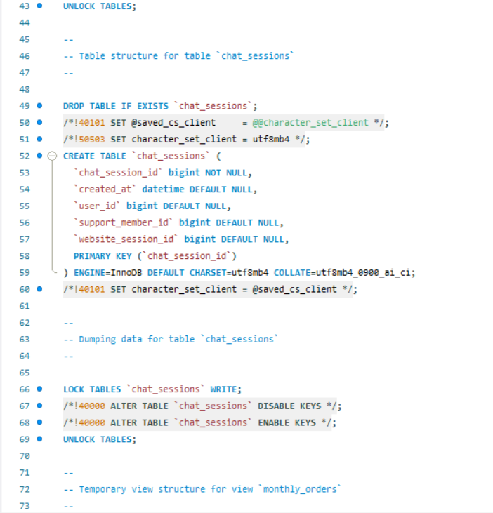

# 🛒 Storehub - E-Commerce Database Project

This project presents a robust, scalable MySQL database solution designed from scratch for a fictional e-commerce platform named "CartMart." It includes complete database schema design, SQL logic automation, performance optimization, analytics-ready views, and backup strategies.

---

## 🧱 Database Design

The schema models real-world business entities and includes the following tables:

- users
- support_members
- chat_sessions
- chat_messages
- products
- order_items
- order_item_refunds
- orders
- website_sessions
- website_pageviews

All relationships are enforced using foreign key constraints to ensure referential integrity and consistency.

### 📷 ER Diagram

 <!-- Replace with actual image path -->

---

## ⚙️ SQL Logic & Automation

### ✅ Triggers

- `insert_orders`: Automatically inserts/updates records in the orders table after an insert into order_items, computing:
  - total price
  - number of items
  - total COGS (cost of goods sold)

### 📦 Stored Procedure

- `order_performance(startDate, endDate)`:
  - Outputs order count and revenue for a custom date range
  - Used in business dashboards and ROI tracking

---

## 📊 Analytical Views

Three core views were developed to support marketing and sales analytics:

- `monthly_orders`: Computes monthly revenue from orders
- `monthly_sessions`: Tracks user sessions by marketing source/campaign
- `monthly_website_sessions`: Similar to above, focused on website sessions

### 📷 Sample View Output


---

## 🚀 Performance Optimization

Strategic indexing was applied to reduce query cost and improve scan efficiency:

| Table             | Indexed Column |
| ----------------- | -------------- |
| order_items       | product_id     |
| order_items       | created_at     |
| website_sessions  | created_at     |
| website_pageviews | created_at     |

Using `EXPLAIN ANALYZE`, query cost was reduced from 1607 to 186 rows scanned — achieving significant speedup.

### 📷 Before & After Optimization


---

## 🧪 Data

All data used in the project is provided in CSV format under `/data/`. These files represent:

- Order item transactions and refunds across multiple years
- Website sessions and pageviews
- Marketing campaign attribution data

### 📷 Sample Data Files


---

## 💾 Backup Strategy

### 🧠 Logical Backup

- Performed using `mysqldump`
- File: `CartMart_logical_backup.sql` located in `/backup/logical/`

### 🗃️ Physical Backup

- Table-wise CSV exports stored in `/backup/physical/`
- Ensures compatibility with both restoration and data ingestion pipelines

### 📷 Backup Files Screenshot



---

## 🧰 Tools Used

- MySQL 8.x
- MySQL Workbench (for .mwb ER modeling)
- Excel/Sheets for preprocessing CSV
- EXPLAIN ANALYZE for benchmarking queries

---

## 🧪 ER Model

- File: `01-Cartmart.mwb`
- Tool: MySQL Workbench
- Includes relational design for all business entities and relationships

---

## ✅ Getting Started

To recreate the schema locally:

```bash
# Step 1: Create DB
mysql -u root -p
CREATE DATABASE CartMart;

# Step 2: Import schema
mysql -u root -p CartMart < schema/01-CartMart.sql
mysql -u root -p CartMart< schema/02-CartMart.sql
...

# Or load logical backup directly
mysql -u root -p CartMart < backup/logical/CartMart_logical_backup.sql
```
